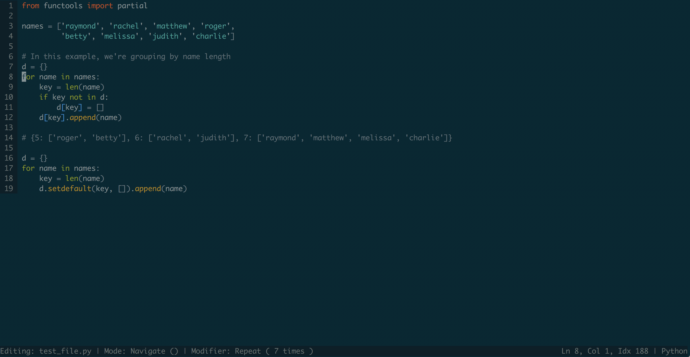

# bullet
A (very early stage WIP) terminal based text editor written in Rust

The initial iterations will have very limited Unicode support, as the editor
currently deals with code points directly, rather than grapheme clusters.

Here's how it currently looks:

